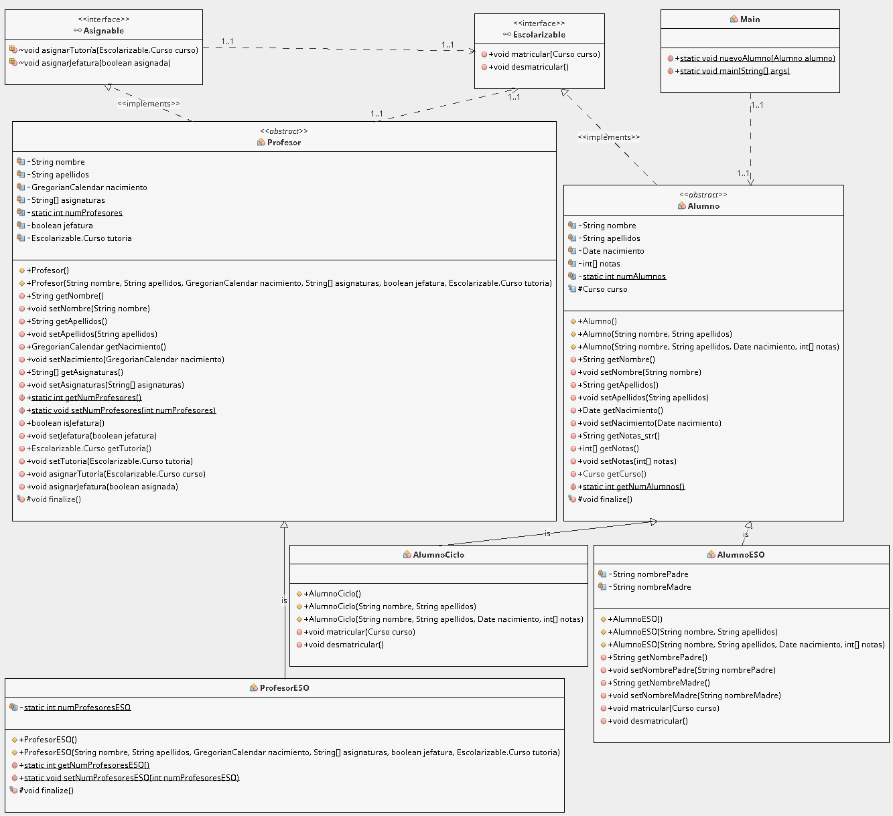

# colegio

JAVA: Jerarquía de clases

- **JOSÉ PABLO REYES JIMÉNEZ**
- **Fecha de nacimiento: 10/02/1996**
- **IES Luis Velez de Guevara**

**Proyecto Java para mostrar el trabajo con jerarquía de clases**.

## Introducción

Para ejecutar en Netbeans, crear un proyecto nuevo y copiar dentro la carpeta `src`.

## Diagrama de clases

> Diagrama realizado con el plugin EasyUML de Netbeans
